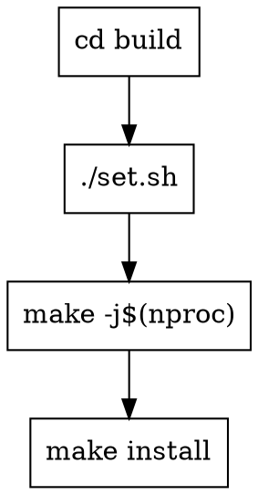

# Building Eye

## Overview

CMake-based embedded Linux build for IPCamera eye project targeting Hi3516cv610 chip with arm-v01c02-linux-musleabi cross-compilation toolchain.

## Build Flow



## Steps

### 1. Configure

```bash
cd build && ./set.sh
```

**set.sh 脚本功能：**
- 清理 build 目录（保留 clean.sh、set.sh）
- 使用 Debug 构建类型（`-O0 -g`）
- 自动设置 `CMAKE_TOOLCHAIN_FILE`

### 2. Build

```bash
make -j$(nproc)
```

### 3. Install

```bash
make install
```

**Default install path:** `~/eyeOut`

## Key Parameters

| Parameter | Value |
|-----------|-------|
| CROSS_PREFIX | `arm-v01c02-linux-musleabi-` |
| CMAKE_TOOLCHAIN_FILE | `cmake/toolchain-arm-v01c02.cmake` |
| CMAKE_BUILD_TYPE | `Debug` |
| Target chip | Hi3516cv610 (Cortex-A7) |

## Third-Party Dependencies

Located in `thirdparty/`:
- `hi3516cv610_mpp/` - Hisilicon Media Processing Platform
- `live555/` - Streaming media libraries
- `openssl/` - SSL/TLS crypto library
- `zlog/` - Logging library

## Quick Commands

```bash
# Full rebuild
cd build && ./set.sh && make -j$(nproc) && make install

# Incremental build only
cd build && make -j$(nproc)
```

## Common Issues

| Symptom | Solution |
|---------|----------|
| `CMAKE_TOOLCHAIN_FILE` not found | set.sh 自动处理，使用相对路径 |
| Missing `thirdparty/` headers | Ensure all submodules cloned: `git clone --recursive` or `git submodule update --init` |
| Install permission denied | Default install is `~/eyeOut`, ensure HOME is set or use `-DCMAKE_INSTALL_PREFIX` |
